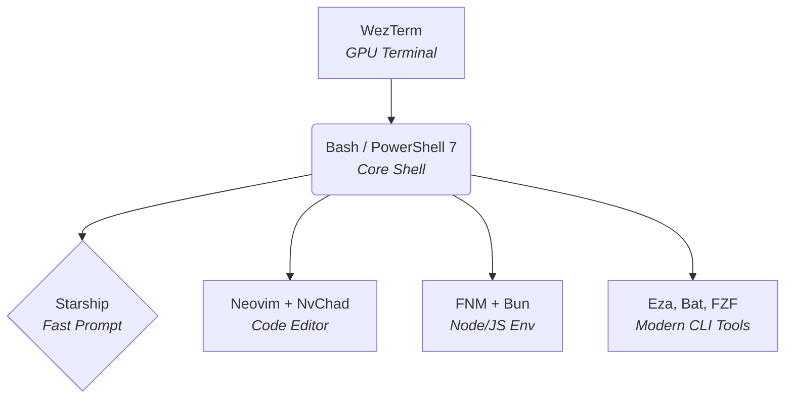

This file is a merged representation of the entire codebase, combined into a single document by Repomix.

# File Summary

## Purpose
This file contains a packed representation of the entire repository's contents.
It is designed to be easily consumable by AI systems for analysis, code review,
or other automated processes.

## File Format
The content is organized as follows:
1. This summary section
2. Repository information
3. Directory structure
4. Repository files (if enabled)
5. Multiple file entries, each consisting of:
  a. A header with the file path (## File: path/to/file)
  b. The full contents of the file in a code block

## Usage Guidelines
- This file should be treated as read-only. Any changes should be made to the
  original repository files, not this packed version.
- When processing this file, use the file path to distinguish
  between different files in the repository.
- Be aware that this file may contain sensitive information. Handle it with
  the same level of security as you would the original repository.

## Notes
- Some files may have been excluded based on .gitignore rules and Repomix's configuration
- Binary files are not included in this packed representation. Please refer to the Repository Structure section for a complete list of file paths, including binary files
- Files matching patterns in .gitignore are excluded
- Files matching default ignore patterns are excluded
- Files are sorted by Git change count (files with more changes are at the bottom)

# Directory Structure
```
bin/
  dot
  dot.ps1
nvim/
  lua/
    configs/
      conform.lua
      lazy.lua
      lspconfig.lua
    plugins/
      init.lua
    autocmds.lua
    chadrc.lua
    mappings.lua
    options.lua
  .stylua.toml
  init.lua
  lazy-lock.json
powershell/
  functions.ps1
  set_up_windows.ps1
  user_profile.ps1
scoop/
  config.json
scripts/
  add.ps1
  add.sh
  eject.ps1
  eject.sh
  generate_theme.py
  install.ps1
  install.sh
  uninstall.ps1
  uninstall.sh
shell/
  .bashrc
starship/
  starship.toml
themes/
  generated/
    theme.lua
    theme.ps1
    theme.sh
  theme.json
wezterm/
  core.lua
  status.lua
  ui.lua
  wezterm.lua
README.md
```

# Files

## File: nvim/lua/configs/conform.lua
````lua
local options = {
  formatters_by_ft = {
    lua = { "stylua" },
    -- css = { "prettier" },
    -- html = { "prettier" },
  },

  -- format_on_save = {
  --   -- These options will be passed to conform.format()
  --   timeout_ms = 500,
  --   lsp_fallback = true,
  -- },
}

return options
````

## File: nvim/lua/configs/lazy.lua
````lua
return {
  defaults = { lazy = true },
  install = { colorscheme = { "nvchad" } },

  ui = {
    icons = {
      ft = "",
      lazy = "󰂠 ",
      loaded = "",
      not_loaded = "",
    },
  },

  performance = {
    rtp = {
      disabled_plugins = {
        "2html_plugin",
        "tohtml",
        "getscript",
        "getscriptPlugin",
        "gzip",
        "logipat",
        "netrw",
        "netrwPlugin",
        "netrwSettings",
        "netrwFileHandlers",
        "matchit",
        "tar",
        "tarPlugin",
        "rrhelper",
        "spellfile_plugin",
        "vimball",
        "vimballPlugin",
        "zip",
        "zipPlugin",
        "tutor",
        "rplugin",
        "syntax",
        "synmenu",
        "optwin",
        "compiler",
        "bugreport",
        "ftplugin",
      },
    },
  },
}
````

## File: nvim/lua/configs/lspconfig.lua
````lua
require("nvchad.configs.lspconfig").defaults()

local servers = { "html", "cssls" }
vim.lsp.enable(servers)

-- read :h vim.lsp.config for changing options of lsp servers
````

## File: nvim/lua/plugins/init.lua
````lua
return {
  {
    "stevearc/conform.nvim",
    -- event = 'BufWritePre', -- uncomment for format on save
    opts = require "configs.conform",
  },

  -- These are some examples, uncomment them if you want to see them work!
  {
    "neovim/nvim-lspconfig",
    config = function()
      require "configs.lspconfig"
    end,
  },

  -- test new blink
  -- { import = "nvchad.blink.lazyspec" },

  -- {
  -- 	"nvim-treesitter/nvim-treesitter",
  -- 	opts = {
  -- 		ensure_installed = {
  -- 			"vim", "lua", "vimdoc",
  --      "html", "css"
  -- 		},
  -- 	},
  -- },
}
````

## File: nvim/lua/autocmds.lua
````lua
require "nvchad.autocmds"


local default_im = "1033"
local current_im = default_im

local function get_im()
    local result = vim.fn.system('im-select.exe')
    return result:gsub("%s+", "")
end

local function set_im(im)
    vim.fn.jobstart({ 'im-select.exe', im }, { detach = true })
end

local im_augroup = vim.api.nvim_create_augroup("IMSelect", { clear = true })

vim.api.nvim_create_autocmd("InsertLeave", {
    group = im_augroup,
    callback = function()
        current_im = get_im()
        set_im(default_im)
    end,
})

vim.api.nvim_create_autocmd("InsertEnter", {
    group = im_augroup,
    callback = function()
        set_im(current_im)
    end,
})

vim.api.nvim_create_autocmd("VimEnter", {
    group = im_augroup,
    callback = function()
        set_im(default_im)
    end,
})

vim.api.nvim_create_autocmd("CmdlineEnter", {
    group = im_augroup,
    callback = function()
        set_im(default_im)
    end,
})
````

## File: nvim/lua/mappings.lua
````lua
require "nvchad.mappings"

-- add yours here

local map = vim.keymap.set

map("n", ";", ":", { desc = "CMD enter command mode" })
map("i", "jk", "<ESC>")
map("n", "<C-\\>", "<cmd>vsplit<CR>", { desc = "Chia dọc màn hình (Vertical Split)" })
-- map({ "n", "i", "v" }, "<C-s>", "<cmd> w <cr>")
````

## File: nvim/lua/options.lua
````lua
require "nvchad.options"

-- add yours here!

-- local o = vim.o
-- o.cursorlineopt ='both' -- to enable cursorline!
````

## File: nvim/.stylua.toml
````toml
column_width = 120
line_endings = "Unix"
indent_type = "Spaces"
indent_width = 2
quote_style = "AutoPreferDouble"
call_parentheses = "None"
````

## File: nvim/lazy-lock.json
````json
{
  "LuaSnip": { "branch": "master", "commit": "0abc8f390b278c3b4aabc4c004ac8a088b65cf24" },
  "NvChad": { "branch": "v2.5", "commit": "add44b952d631981614bbb8cfc6f7002f296dfe6" },
  "base46": { "branch": "v3.0", "commit": "267954c8663607823f03a3259bb8deb15688212f" },
  "cmp-async-path": { "branch": "main", "commit": "98185a91d49ff5dd249aebf2f7456e18063fa2a0" },
  "cmp-buffer": { "branch": "main", "commit": "b74fab3656eea9de20a9b8116afa3cfc4ec09657" },
  "cmp-nvim-lsp": { "branch": "main", "commit": "cbc7b02bb99fae35cb42f514762b89b5126651ef" },
  "cmp-nvim-lua": { "branch": "main", "commit": "e3a22cb071eb9d6508a156306b102c45cd2d573d" },
  "cmp_luasnip": { "branch": "master", "commit": "98d9cb5c2c38532bd9bdb481067b20fea8f32e90" },
  "conform.nvim": { "branch": "master", "commit": "016802de402556da54c36bd7359b441266b01cdd" },
  "friendly-snippets": { "branch": "main", "commit": "6cd7280adead7f586db6fccbd15d2cac7e2188b9" },
  "gitsigns.nvim": { "branch": "main", "commit": "5be654f2232c10ddcad19c1607a67b6b4b78fc29" },
  "indent-blankline.nvim": { "branch": "master", "commit": "d28a3f70721c79e3c5f6693057ae929f3d9c0a03" },
  "lazy.nvim": { "branch": "main", "commit": "85c7ff3711b730b4030d03144f6db6375044ae82" },
  "mason.nvim": { "branch": "main", "commit": "2a6940af80375532e5e9e7c1f2fc6319a1b7a69d" },
  "menu": { "branch": "main", "commit": "7a0a4a2896b715c066cfbe320bdc048091874cc6" },
  "minty": { "branch": "main", "commit": "aafc9e8e0afe6bf57580858a2849578d8d8db9e0" },
  "nvim-autopairs": { "branch": "master", "commit": "7b9923abad60b903ece7c52940e1321d39eccc79" },
  "nvim-cmp": { "branch": "main", "commit": "2ffe79f1f021def8dd1fcd81deb16f1bb0d989f3" },
  "nvim-lspconfig": { "branch": "master", "commit": "6fc041976833841cc9d991f45193533fe2a2e09b" },
  "nvim-tree.lua": { "branch": "master", "commit": "b2aadda94b107480c48e548d6db51c6840b7b33c" },
  "nvim-treesitter": { "branch": "main", "commit": "074aa4422bf029908338e855d0c0f71470a971bb" },
  "nvim-web-devicons": { "branch": "master", "commit": "2ae6958df7ced50baac5035cec0c15799eedfbf7" },
  "plenary.nvim": { "branch": "master", "commit": "74b06c6c75e4eeb3108ec01852001636d85a932b" },
  "telescope.nvim": { "branch": "master", "commit": "40aedd8a68c78a656a10a8d62d80c54af59420fb" },
  "ui": { "branch": "v3.0", "commit": "fe781d1c12860d6a25d45e588fe4fdd27eb34a1a" },
  "volt": { "branch": "main", "commit": "620de1321f275ec9d80028c68d1b88b409c0c8b1" },
  "which-key.nvim": { "branch": "main", "commit": "3aab2147e74890957785941f0c1ad87d0a44c15a" }
}
````

## File: scoop/config.json
````json
{
  "last_update": "2026-08-18T22:46:50.6076736+07:00",
  "scoop_repo": "https://github.com/ScoopInstaller/Scoop",
  "scoop_branch": "master",
  "purge_old_versions": true
}
````

## File: scripts/add.ps1
````powershell
param([string]$TargetPath)

if ([string]::IsNullOrWhiteSpace($TargetPath)) {
    Write-Host "❌ Vui lòng cung cấp đường dẫn cần thu nạp!" -ForegroundColor Red
    Write-Host "Ví dụ: dot add `$env:APPDATA\alacritty" -ForegroundColor Cyan
    exit
}

if (!(Test-Path $TargetPath)) {
    Write-Host "❌ Đường dẫn không tồn tại: $TargetPath" -ForegroundColor Red
    exit
}

$resolvedPath = (Resolve-Path $TargetPath).Path
$item = Get-Item $resolvedPath -Force

if ($item.LinkType -eq "SymbolicLink") {
    Write-Host "❌ Đường dẫn này đã là symlink (đã được quản lý rồi)!" -ForegroundColor Red
    exit
}

$DotfilesDir = Split-Path -Path $PSScriptRoot -Parent
$basename = Split-Path $resolvedPath -Leaf

Write-Host "`n🔹 Đang thu nạp '$basename' vào kho dotfiles..." -ForegroundColor Cyan

Move-Item -Path $resolvedPath -Destination "$DotfilesDir\$basename" -Force

try {
    New-Item -ItemType SymbolicLink -Path $resolvedPath -Target "$DotfilesDir\$basename" -Force | Out-Null
    Write-Host "  ✅ Thu nạp thành công!" -ForegroundColor Green
    Write-Host "`n⚠️  LƯU Ý QUAN TRỌNG:" -ForegroundColor Yellow
    Write-Host "Hãy nhớ mở scripts\install.ps1 và thêm `"$basename`" vào mảng `$configApps để nó được tự động cài đặt vào lần sau nhé!" -ForegroundColor Yellow
} catch {
    Write-Host "  ❌ Lỗi khi tạo lại Symlink. Vui lòng kiểm tra quyền Admin hoặc chế độ Developer Mode!" -ForegroundColor Red
    Write-Host "     Chi tiết lỗi: $($_.Exception.Message)" -ForegroundColor Red
}
````

## File: scripts/add.sh
````bash
#!/usr/bin/env bash
set -e

TARGET_PATH="$1"
if [ -z "$TARGET_PATH" ]; then
    echo -e "\033[0;31m❌ Vui lòng cung cấp đường dẫn cần thu nạp!\033[0m"
    echo -e "Ví dụ: \033[0;36mdot add ~/.config/alacritty\033[0m"
    exit 1
fi

TARGET_PATH=$(realpath "$TARGET_PATH" 2>/dev/null || echo "$TARGET_PATH")

if [ ! -e "$TARGET_PATH" ]; then
    echo -e "\033[0;31m❌ Đường dẫn không tồn tại: $TARGET_PATH\033[0m"
    exit 1
fi

if [ -L "$TARGET_PATH" ]; then
    echo -e "\033[0;31m❌ Đường dẫn này đã là symlink (đã được quản lý rồi)!\033[0m"
    exit 1
fi

DOTFILES_DIR="$(cd "$(dirname "${BASH_SOURCE[0]}")/.." && pwd)"
BASENAME=$(basename "$TARGET_PATH")

echo -e "\033[0;36m🔹 Đang thu nạp '$BASENAME' vào kho dotfiles...\033[0m"
mv "$TARGET_PATH" "$DOTFILES_DIR/$BASENAME"
ln -sf "$DOTFILES_DIR/$BASENAME" "$TARGET_PATH"

echo -e "  \033[0;32m✅ Thu nạp thành công!\033[0m"
echo -e "\n\033[1;33m⚠️  LƯU Ý QUAN TRỌNG:\033[0m"
echo -e "Hãy nhớ mở \033[0;36mscripts/install.sh\033[0m và thêm \033[1;32m\"$BASENAME\"\033[0m vào mảng \033[1;35mCONFIG_APPS\033[0m để nó được tự động cài đặt vào lần sau nhé!"
````

## File: scripts/eject.ps1
````powershell
$DotfilesDir = Split-Path -Path $PSScriptRoot -Parent
Write-Host "`n🔹 Đang phục hồi (eject) cấu hình về máy thực..." -ForegroundColor Cyan

$configApps = @{
    "wezterm" = "$env:USERPROFILE\.config\wezterm"
    "nvim" = "$env:LOCALAPPDATA\nvim"
    "alacritty" = "$env:APPDATA\alacritty"
    "starship" = "$env:USERPROFILE\.config\starship"
}

foreach ($app in $configApps.GetEnumerator()) {
    $dest = $app.Value
    $src = "$DotfilesDir\$($app.Key)"
    if (Test-Path $dest) {
        $item = Get-Item $dest -Force
        if ($item.LinkType -eq "SymbolicLink") {
            Remove-Item $dest -Force
            Copy-Item -Path $src -Destination $dest -Recurse -Force
            Write-Host "  ✅ Đã phục hồi: $($app.Key) -> $dest" -ForegroundColor Green
        }
    }
}

# Riêng WezTerm file lua
if (Test-Path "$env:USERPROFILE\.wezterm.lua") {
    $wzItem = Get-Item "$env:USERPROFILE\.wezterm.lua"
    if ($wzItem.LinkType -eq "SymbolicLink") {
        Remove-Item "$env:USERPROFILE\.wezterm.lua" -Force
        Copy-Item -Path "$DotfilesDir\wezterm\wezterm.lua" -Destination "$env:USERPROFILE\.wezterm.lua" -Force
        Write-Host "  ✅ Đã phục hồi: wezterm.lua -> $env:USERPROFILE\.wezterm.lua" -ForegroundColor Green
    }
}

Write-Host "`n🎉 Quá trình EJECT hoàn tất! Máy bạn đã độc lập." -ForegroundColor Green
Write-Host "Giờ bạn có thể xóa an toàn thư mục: $DotfilesDir" -ForegroundColor Yellow
````

## File: scripts/eject.sh
````bash
#!/usr/bin/env bash
set -e
DOTFILES_DIR="$(cd "$(dirname "${BASH_SOURCE[0]}")/.." && pwd)"
CONFIG_APPS=("wezterm" "nvim" "alacritty" "tmux" "starship")

echo -e "\033[0;36m🔹 Đang phục hồi (eject) cấu hình về máy thực...\033[0m"

for app in "${CONFIG_APPS[@]}"; do
    target="$HOME/.config/$app"
    source="$DOTFILES_DIR/$app"
    if [ -L "$target" ]; then
        rm -f "$target"
        cp -r "$source" "$target"
        echo -e "  \033[0;32m✅ Đã phục hồi: $app -> $target\033[0m"
    fi
done

echo -e "\n\033[0;32m🎉 Quá trình EJECT hoàn tất! Máy bạn đã độc lập.\033[0m"
echo -e "\033[0;33mGiờ bạn có thể xóa an toàn thư mục: $DOTFILES_DIR\033[0m"
````

## File: scripts/generate_theme.py
````python
import json
import os
from pathlib import Path

# Setup paths
script_dir = Path(__file__).parent
dotfiles_dir = script_dir.parent
theme_json_path = dotfiles_dir / "themes" / "theme.json"
out_dir = dotfiles_dir / "themes" / "generated"

out_dir.mkdir(parents=True, exist_ok=True)

# Read theme JSON
with open(theme_json_path, "r", encoding="utf-8") as f:
    theme_data = json.load(f)

# Generate Lua
lua_content = "-- Auto-generated by generate_theme.py\nreturn {\n"
for key, value in theme_data.items():
    if key != "name":
        lua_content += f'  {key} = "{value}",\n'
lua_content += "}\n"

with open(out_dir / "theme.lua", "w", encoding="utf-8") as f:
    f.write(lua_content)

# Generate Shell (Bash)
sh_content = "# Auto-generated by generate_theme.py\n"
for key, value in theme_data.items():
    if key != "name":
        sh_content += f'export THEME_{key.upper()}="{value}"\n'

with open(out_dir / "theme.sh", "w", encoding="utf-8") as f:
    f.write(sh_content)

# Generate PowerShell
ps1_content = "# Auto-generated by generate_theme.py\n"
for key, value in theme_data.items():
    if key != "name":
        ps1_content += f'$env:THEME_{key.upper()}="{value}"\n'

with open(out_dir / "theme.ps1", "w", encoding="utf-8") as f:
    f.write(ps1_content)

print(f"Theme '{theme_data.get('name', 'Custom')}' compiled successfully to {out_dir}")
````

## File: scripts/uninstall.ps1
````powershell
# ==============================================================================
# Dotfiles Uninstaller for Windows
# ==============================================================================

Write-Host "Bắt đầu gỡ cài đặt (Uninstall) Dotfiles..." -ForegroundColor Red

# 1. Xóa symlinks
Write-Host "Xóa các symlink cấu hình..." -ForegroundColor Cyan
$links = @(
    "$env:USERPROFILE\.wezterm.lua",
    "$env:USERPROFILE\.config\wezterm",
    "$env:LOCALAPPDATA\nvim",
    "$env:USERPROFILE\.config\powershell\functions.ps1",
    "$env:USERPROFILE\.config\scoop\config.json"
)

foreach ($link in $links) {
    if (Test-Path $link) {
        Remove-Item $link -Force -Recurse
        Write-Host "  Đã xóa: $link" -ForegroundColor Green
    }
}

# 2. Gỡ cấu hình khỏi PowerShell profile
Write-Host "Gỡ cấu hình khỏi PowerShell Profile..." -ForegroundColor Cyan
$profiles = @(
    "$env:USERPROFILE\Documents\PowerShell\Microsoft.PowerShell_profile.ps1",
    "$env:USERPROFILE\Documents\WindowsPowerShell\Microsoft.PowerShell_profile.ps1"
)

foreach ($pPath in $profiles) {
    if (Test-Path $pPath) {
        $content = Get-Content $pPath -Raw
        $content = $content -replace "(?ms)# Load dotfiles user profile.*?user_profile\.ps1`".*?`n", ""
        Set-Content -Path $pPath -Value $content -Force
        Write-Host "  Đã gỡ cấu hình khỏi: $pPath" -ForegroundColor Green
    }
}

Write-Host "`nHoàn tất gỡ cài đặt! Các file gốc/backup (.bak_*) của bạn vẫn được giữ nguyên." -ForegroundColor Green
````

## File: scripts/uninstall.sh
````bash
#!/usr/bin/env bash
# ==============================================================================
# Dotfiles Uninstaller for Linux / macOS
# ==============================================================================

echo -e "\033[0;31mBắt đầu gỡ cài đặt (Uninstall) Dotfiles...\033[0m"

# 1. Xóa symlinks
echo "Xóa các symlink cấu hình..."
rm -f "$HOME/.config/wezterm"
rm -f "$HOME/.config/nvim"

# 2. Xóa cấu hình khỏi bashrc / zshrc
echo "Gỡ bỏ cấu hình dotfiles khỏi .bashrc / .zshrc..."
if [ -f "$HOME/.bashrc" ]; then
    sed -i '/# Load dotfiles config/d' "$HOME/.bashrc"
    sed -i '\|dotfiles/shell/.bashrc|d' "$HOME/.bashrc"
fi
if [ -f "$HOME/.zshrc" ]; then
    sed -i '/# Load dotfiles config/d' "$HOME/.zshrc"
    sed -i '\|dotfiles/shell/.bashrc|d' "$HOME/.zshrc"
fi

# 3. Gỡ cấu hình pwsh (Linux)
PWSH_PROFILE="$HOME/.config/powershell/Microsoft.PowerShell_profile.ps1"
if [ -f "$PWSH_PROFILE" ]; then
    sed -i '/# Load dotfiles config/d' "$PWSH_PROFILE"
    sed -i '\|user_profile.ps1|d' "$PWSH_PROFILE"
fi

echo -e "\033[0;32mHoàn tất gỡ cài đặt! Các file gốc/backup (.bak_*) của bạn vẫn được giữ nguyên.\033[0m"
````

## File: starship/starship.toml
````toml
"$schema" = 'https://starship.rs/config-schema.json'

palette = 'catppuccin_frappe'
add_newline = false

format = """
$os\
$username\
$directory\
$git_branch\
$git_status\
$c\
$rust\
$golang\
$nodejs\
$bun\
$php\
$java\
$kotlin\
$haskell\
$python\
$conda\
$cmd_duration\
$character"""

right_format = "$time"

[username]
show_always = true
style_user = "red"
style_root = "bold red"
format = '[$user ]($style)'

[directory]
style = "peach"
format = "[$path ]($style)"
truncation_length = 3

[directory.substitutions]
"Documents" = "󰈙 "
"Downloads" = " "
"Music" = "󰝚 "
"Pictures" = " "
"Developer" = "󰲋 "

[git_branch]
symbol = ""
style = "yellow"
format = '[$symbol $branch ]($style)'

[git_status]
style = "yellow"
format = '([$all_status$ahead_behind ]($style))'

[nodejs]
symbol = ""
style = "green"
format = '[$symbol( $version) ]($style)'

[bun]
symbol = ""
style = "green"
format = '[$symbol( $version) ]($style)'

[c]
symbol = ""
style = "green"
format = '[$symbol( $version) ]($style)'

[rust]
symbol = ""
style = "green"
format = '[$symbol( $version) ]($style)'

[golang]
symbol = ""
style = "green"
format = '[$symbol( $version) ]($style)'

[php]
symbol = ""
style = "green"
format = '[$symbol( $version) ]($style)'

[java]
symbol = ""
style = "green"
format = '[$symbol( $version) ]($style)'

[kotlin]
symbol = ""
style = "green"
format = '[$symbol( $version) ]($style)'

[haskell]
symbol = ""
style = "green"
format = '[$symbol( $version) ]($style)'

[python]
symbol = ""
style = "green"
format = '[$symbol( $version)(\(#$virtualenv\)) ]($style)'

[docker_context]
symbol = ""
style = "sapphire"
format = '[$symbol( $context) ]($style)'

[conda]
symbol = ""
style = "sapphire"
format = '[ $symbol $environment ]($style)'
ignore_base = false

[time]
disabled = false
time_format = "%R"
style = "lavender"
format = '[ $time ]($style)'

[character]
disabled = false
success_symbol = '[➜](bold green)'
error_symbol = '[➜](bold red)'
vimcmd_symbol = '[⬅](bold green)'
vimcmd_replace_one_symbol = '[⬅](bold lavender)'
vimcmd_replace_symbol = '[⬅](bold lavender)'
vimcmd_visual_symbol = '[⬅](bold yellow)'

[cmd_duration]
show_milliseconds = true
format = "[ in $duration ]($style)"
style = "lavender"
disabled = false
show_notifications = true
min_time_to_notify = 45000


[palettes.catppuccin_frappe]
rosewater = "#f2d5cf"
flamingo = "#eebebe"
pink = "#f4b8e4"
mauve = "#ca9ee6"
red = "#e78284"
maroon = "#ea999c"
peach = "#ef9f76"
yellow = "#e5c890"
green = "#a6d189"
teal = "#81c8be"
sky = "#99d1db"
sapphire = "#85c1dc"
blue = "#8caaee"
lavender = "#babbf1"
text = "#c6d0f5"
subtext1 = "#b5bfe2"
subtext0 = "#a5adce"
overlay2 = "#949cbb"
overlay1 = "#838ba7"
overlay0 = "#737994"
surface2 = "#626880"
surface1 = "#51576d"
surface0 = "#414559"
base = "#303446"
mantle = "#292c3c"
crust = "#232634"
````

## File: themes/generated/theme.lua
````lua
-- Auto-generated by generate_theme.py
return {
  bg = "#1e1e2e",
  fg = "#cdd6f4",
  black = "#45475a",
  red = "#f38ba8",
  green = "#a6e3a1",
  yellow = "#f9e2af",
  blue = "#89b4fa",
  magenta = "#f5c2e7",
  cyan = "#94e2d5",
  white = "#bac2de",
}
````

## File: themes/generated/theme.ps1
````powershell
# Auto-generated by generate_theme.py
$env:THEME_BG="#1e1e2e"
$env:THEME_FG="#cdd6f4"
$env:THEME_BLACK="#45475a"
$env:THEME_RED="#f38ba8"
$env:THEME_GREEN="#a6e3a1"
$env:THEME_YELLOW="#f9e2af"
$env:THEME_BLUE="#89b4fa"
$env:THEME_MAGENTA="#f5c2e7"
$env:THEME_CYAN="#94e2d5"
$env:THEME_WHITE="#bac2de"
````

## File: themes/generated/theme.sh
````bash
# Auto-generated by generate_theme.py
export THEME_BG="#1e1e2e"
export THEME_FG="#cdd6f4"
export THEME_BLACK="#45475a"
export THEME_RED="#f38ba8"
export THEME_GREEN="#a6e3a1"
export THEME_YELLOW="#f9e2af"
export THEME_BLUE="#89b4fa"
export THEME_MAGENTA="#f5c2e7"
export THEME_CYAN="#94e2d5"
export THEME_WHITE="#bac2de"
````

## File: themes/theme.json
````json
{
  "name": "Catppuccin Mocha",
  "bg": "#1e1e2e",
  "fg": "#cdd6f4",
  "black": "#45475a",
  "red": "#f38ba8",
  "green": "#a6e3a1",
  "yellow": "#f9e2af",
  "blue": "#89b4fa",
  "magenta": "#f5c2e7",
  "cyan": "#94e2d5",
  "white": "#bac2de"
}
````

## File: wezterm/wezterm.lua
````lua
local wezterm = require 'wezterm'
local config = wezterm.config_builder()

require('core').setup(config)
require('ui').setup(config)
require('status').setup()

return config
````

## File: nvim/lua/chadrc.lua
````lua
-- This file needs to have same structure as nvconfig.lua 
-- https://github.com/NvChad/ui/blob/v3.0/lua/nvconfig.lua
-- Please read that file to know all available options :( 

---@type ChadrcConfig
local M = {}

M.base46 = {
	theme = "catppuccin",

	-- hl_override = {
	-- 	Comment = { italic = true },
	-- 	["@comment"] = { italic = true },
	-- },
}

-- M.nvdash = { load_on_startup = true }
-- M.ui = {
--       tabufline = {
--          lazyload = false
--      }
-- }

return M
````

## File: nvim/init.lua
````lua
vim.g.base46_cache = vim.fn.stdpath "data" .. "/base46/"
vim.g.mapleader = " "

-- bootstrap lazy and all plugins
local lazypath = vim.fn.stdpath "data" .. "/lazy/lazy.nvim"

if not vim.uv.fs_stat(lazypath) then
  local repo = "https://github.com/folke/lazy.nvim.git"
  vim.fn.system { "git", "clone", "--filter=blob:none", repo, "--branch=stable", lazypath }
end

vim.opt.rtp:prepend(lazypath)

local lazy_config = require "configs.lazy"

-- load plugins
require("lazy").setup({
  {
    "NvChad/NvChad",
    lazy = false,
    branch = "v2.5",
    import = "nvchad.plugins",
  },

  { import = "plugins" },
}, lazy_config)

-- load theme
dofile(vim.g.base46_cache .. "defaults")
dofile(vim.g.base46_cache .. "statusline")

require "options"
require "autocmds"

vim.schedule(function()
  require "mappings"
end)

-- Apply dynamically generated custom theme overrides
local theme_path = os.getenv("HOME") .. "/Desktop/Work/dotfiles/themes/generated/theme.lua"
local success, theme = pcall(dofile, theme_path)
if success then
  vim.schedule(function()
    vim.api.nvim_set_hl(0, "Normal", { bg = theme.bg, fg = theme.fg })
    vim.api.nvim_set_hl(0, "NormalFloat", { bg = theme.bg })
    vim.api.nvim_set_hl(0, "LineNr", { fg = theme.black })
    -- Add more custom overrides here if needed
  end)
end
````

## File: powershell/set_up_windows.ps1
````powershell
# Wrapper script để chạy installer chính
$installScript = Join-Path $PSScriptRoot "..\install.ps1"
if (Test-Path $installScript) {
    & $installScript @args
} else {
    Write-Host "Downloading and running latest installer..." -ForegroundColor Cyan
    irm https://raw.githubusercontent.com/kachitaro/dotfiles/main/install.ps1 | iex
}
````

## File: scripts/install.ps1
````powershell
# ==============================================================================
# 🚀 Windows Dotfiles & Dev Environment One-Command Installer
# Usage:
#   irm https://raw.githubusercontent.com/kachitaro/dotfiles/main/install.ps1 | iex
# Or locally:
#   .\install.ps1
# ==============================================================================

[CmdletBinding()]
param (
    [string]$DotfilesDir = "",
    [switch]$SkipFeatures,
    [switch]$SkipHeavyApps,
    [switch]$ForceInstall
)

# ------------------------------------------------------------------------------
# 0. Setup Environment & Helpers
# ------------------------------------------------------------------------------
$ErrorActionPreference = "Continue"
[Net.ServicePointManager]::SecurityProtocol = [Net.SecurityProtocolType]::Tls12 -bor [Net.SecurityProtocolType]::Tls13

function Write-Step   { param ([string]$msg) Write-Host "`n🔹 [STEP] $msg" -ForegroundColor Cyan }
function Write-Succ   { param ([string]$msg) Write-Host "  ✅ $msg" -ForegroundColor Green }
function Write-Warn   { param ([string]$msg) Write-Host "  ⚠️ $msg" -ForegroundColor Yellow }
function Write-Err    { param ([string]$msg) Write-Host "  ❌ $msg" -ForegroundColor Red }
function Write-Header {
    Clear-Host
    Write-Host @"
====================================================================
  🚀 WINDOWS DOTFILES & ENVIRONMENT AUTO-INSTALLER
  Repository: https://github.com/kachitaro/dotfiles
====================================================================
"@ -ForegroundColor Magenta
}

Write-Header

# 1. Set Execution Policy
Write-Step "Cấu hình PowerShell Execution Policy..."
Set-ExecutionPolicy RemoteSigned -Scope CurrentUser -Force
Write-Succ "Execution Policy đã được đặt thành RemoteSigned cho CurrentUser."

# 2. Determine Dotfiles Path
Write-Step "Xác định thư mục Dotfiles..."
$RepoUrl = "https://github.com/kachitaro/dotfiles.git"
if ([string]::IsNullOrWhiteSpace($DotfilesDir)) {
    if (Test-Path "$PSScriptRoot\..\wezterm\wezterm.lua") {
        $DotfilesDir = Split-Path -Path $PSScriptRoot -Parent
    } elseif (Test-Path "D:\work") {
        $DotfilesDir = "D:\work\dotfiles"
    } elseif (Test-Path "D:\") {
        $DotfilesDir = "D:\dotfiles"
    } else {
        $DotfilesDir = "$env:USERPROFILE\.dotfiles"
    }
}
Write-Host "  Thư mục Dotfiles đích: $DotfilesDir" -ForegroundColor White

# 3. Enable Developer Mode (Cho phép tạo SymbolicLink không cần quyền Admin)
Write-Step "Kích hoạt Developer Mode (hỗ trợ Symlink)..."
try {
    $devModeKey = "HKLM:\SOFTWARE\Microsoft\Windows\CurrentVersion\AppModelUnlock"
    if (Test-Path $devModeKey) {
        $currentVal = (Get-ItemProperty -Path $devModeKey -Name "AllowDevelopmentWithoutDevLicense" -ErrorAction SilentlyContinue).AllowDevelopmentWithoutDevLicense
        if ($currentVal -ne 1) {
            Start-Process powershell -Verb RunAs -Wait -ArgumentList "-NoProfile -Command Set-ItemProperty -Path '$devModeKey' -Name 'AllowDevelopmentWithoutDevLicense' -Value 1 -Type DWord"
        }
    }
    Write-Succ "Developer Mode đã sẵn sàng."
} catch {
    Write-Warn "Không thể tự động bật Developer Mode. Các Symlink có thể yêu cầu quyền Admin."
}

# 4. Install Scoop
Write-Step "Kiểm tra và cài đặt Scoop..."
if (!(Get-Command scoop -ErrorAction SilentlyContinue)) {
    Write-Host "  Đang tải và cài đặt Scoop..." -ForegroundColor Gray
    Invoke-Expression (New-Object System.Net.WebClient).DownloadString('https://get.scoop.sh')
    
    # Reload Path for Scoop in current session
    $env:Path = "$env:USERPROFILE\scoop\shims;$env:USERPROFILE\scoop\apps\scoop\current\bin;" + $env:Path
}
if (Get-Command scoop -ErrorAction SilentlyContinue) {
    Write-Succ "Scoop đã được cài đặt."
} else {
    Write-Err "Không tìm thấy Scoop sau khi cài đặt. Vui lòng kiểm tra lại kết nối mạng."
}

# 5. Configure Scoop Buckets
Write-Step "Cấu hình Scoop Buckets..."
$buckets = @("main", "extras", "nerd-fonts", "java", "nonportable")
foreach ($bucket in $buckets) {
    scoop bucket add $bucket 2>$null
}
scoop update
Write-Succ "Đã cấu hình xong Scoop buckets."

# 6. Install Packages via Scoop
Write-Step "Cài đặt các ứng dụng và công cụ qua Scoop..."

# Danh sách CLI và Utilities bắt buộc
$corePackages = @(
    "main/git",
    "main/7zip",
    "main/curl",
    "main/pwsh",
    "main/neovim",
    "main/ripgrep",
    "main/fd",
    "main/fzf",
    "main/bat",
    "main/eza",
    "main/lazygit",
    "main/starship",
    "main/python",
    "main/fnm",
    "main/bun",
    "main/yarn",
    "java/temurin17-jdk",
    "nerd-fonts/JetBrainsMono-NF",
    "vcredist-aio",
    "extras/wezterm",
    "extras/vscode"
)

# Danh sách ứng dụng lớn (Mobile / Container / Heavy Dev)
$heavyPackages = @(
    "extras/gradle",
    "extras/flutter",
    "extras/android-studio",
    "docker"
)

$packagesToInstall = $corePackages
if (-not $SkipHeavyApps) {
    $packagesToInstall += $heavyPackages
}

foreach ($pkg in $packagesToInstall) {
    $pkgName = $pkg.Split('/')[-1]
    Write-Host "  Đang kiểm tra / cài đặt: $pkg ..." -ForegroundColor Gray
    scoop install $pkg
}
Write-Succ "Hoàn tất cài đặt các gói Scoop."

# 7. Install PowerShell Modules
Write-Step "Cài đặt các module PowerShell (PSReadLine, PSFzf, Terminal-Icons)..."
if (!(Get-PackageProvider -Name NuGet -ListAvailable -ErrorAction SilentlyContinue)) {
    Install-PackageProvider -Name NuGet -MinimumVersion 2.8.5.201 -Force -Scope CurrentUser | Out-Null
}
Set-PSRepository -Name "PSGallery" -InstallationPolicy Trusted -ErrorAction SilentlyContinue

$psModules = @("PSReadLine", "PSFzf", "Terminal-Icons")
foreach ($mod in $psModules) {
    if (!(Get-Module -Name $mod -ListAvailable)) {
        Write-Host "  Đang cài module: $mod..." -ForegroundColor Gray
        Install-Module -Name $mod -Scope CurrentUser -Force -SkipPublisherCheck -AllowClobber
    } else {
        Write-Succ "Module $mod đã tồn tại."
    }
}

# 8. Clone or Update Dotfiles Repository
Write-Step "Đồng bộ Dotfiles từ GitHub..."
if (!(Test-Path "$DotfilesDir\.git")) {
    $parentDir = Split-Path -Path $DotfilesDir -Parent
    if (!(Test-Path $parentDir)) {
        New-Item -ItemType Directory -Path $parentDir -Force | Out-Null
    }
    Write-Host "  Cloning repository vào $DotfilesDir ..." -ForegroundColor Gray
    git clone $RepoUrl $DotfilesDir
} else {
    Write-Host "  Cập nhật repository tại $DotfilesDir ..." -ForegroundColor Gray
    git -C $DotfilesDir pull
}
Write-Succ "Dotfiles đã sẵn sàng tại $DotfilesDir."

# 9. Create Symlinks & Link Configurations
Write-Step "Liên kết các tệp cấu hình (Symlink & Profile)..."

function Create-SafeLink {
    param (
        [string]$LinkPath,
        [string]$TargetPath,
        [string]$Type = "File" # "File" or "Directory"
    )

    if (!(Test-Path $TargetPath)) {
        Write-Warn "Target không tồn tại: $TargetPath"
        return
    }

    $parentDir = Split-Path -Path $LinkPath -Parent
    if (!(Test-Path $parentDir)) {
        New-Item -ItemType Directory -Path $parentDir -Force | Out-Null
    }

    if (Test-Path $LinkPath) {
        $item = Get-Item $LinkPath -Force
        if ($item.LinkType -eq "SymbolicLink") {
            Remove-Item $LinkPath -Force
        } else {
            if ($ForceInstall) {
                Remove-Item $LinkPath -Recurse -Force
                Write-Warn "Đã xóa (ghi đè) file/thư mục hiện tại: $LinkPath"
            } else {
                $backupPath = "$LinkPath.bak_$(Get-Date -Format 'yyyyMMddHHmmss')"
                Write-Warn "Đã sao lưu file/thư mục hiện tại sang $backupPath"
                Rename-Item -Path $LinkPath -NewName (Split-Path $backupPath -Leaf) -Force
            }
        }
    }

    try {
        if ($Type -eq "Directory") {
            New-Item -ItemType SymbolicLink -Path $LinkPath -Target $TargetPath -Force | Out-Null
        } else {
            New-Item -ItemType SymbolicLink -Path $LinkPath -Target $TargetPath -Force | Out-Null
        }
        Write-Succ "Linked: $LinkPath -> $TargetPath"
    } catch {
        # Fallback to copy if symlink is restricted
        Write-Warn "Không thể tạo Symlink ($($_.Exception.Message)). Tiến hành copy file thay thế..."
        if ($Type -eq "Directory") {
            Copy-Item -Path $TargetPath -Destination $LinkPath -Recurse -Force
        } else {
            Copy-Item -Path $TargetPath -Destination $LinkPath -Force
        }
        Write-Succ "Copied: $LinkPath -> $TargetPath"
    }
}

# 9.1 Liên kết cấu hình tự động cho các ứng dụng chuẩn
$configApps = @{
    "wezterm" = "$env:USERPROFILE\.config\wezterm"
    "nvim" = "$env:LOCALAPPDATA\nvim"
    "alacritty" = "$env:APPDATA\alacritty"
    "starship" = "$env:USERPROFILE\.config\starship"
}

foreach ($app in $configApps.GetEnumerator()) {
    $src = "$DotfilesDir\$($app.Key)"
    $dest = $app.Value
    if (Test-Path $src) {
        Create-SafeLink -LinkPath $dest -TargetPath $src -Type "Directory"
    }
}
# Riêng WezTerm trên Windows thường cần file lua ở thư mục gốc
if (Test-Path "$DotfilesDir\wezterm\wezterm.lua") {
    Create-SafeLink -LinkPath "$env:USERPROFILE\.wezterm.lua" -TargetPath "$DotfilesDir\wezterm\wezterm.lua" -Type "File"
}

# 9.3 Functions file
Create-SafeLink -LinkPath "$env:USERPROFILE\.config\powershell\functions.ps1" -TargetPath "$DotfilesDir\powershell\functions.ps1"

# 9.4 Scoop Config
if (Test-Path "$DotfilesDir\scoop\config.json") {
    Create-SafeLink -LinkPath "$env:USERPROFILE\.config\scoop\config.json" -TargetPath "$DotfilesDir\scoop\config.json"
}

# 9.5 PowerShell Profile Configuration (Hỗ trợ cả pwsh và Windows PowerShell 5.1)
$profiles = @(
    "$env:USERPROFILE\Documents\PowerShell\Microsoft.PowerShell_profile.ps1",
    "$env:USERPROFILE\Documents\WindowsPowerShell\Microsoft.PowerShell_profile.ps1"
)

$profileSourceLine = ". `"$DotfilesDir\powershell\user_profile.ps1`""

foreach ($pPath in $profiles) {
    $pDir = Split-Path -Path $pPath -Parent
    if (!(Test-Path $pDir)) {
        New-Item -ItemType Directory -Path $pDir -Force | Out-Null
    }

    $needsWrite = $true
    if (Test-Path $pPath) {
        $content = Get-Content $pPath -Raw -ErrorAction SilentlyContinue
        if ($content -and $content.Contains("user_profile.ps1")) {
            $needsWrite = $false
        }
    }

    if ($needsWrite) {
        Add-Content -Path $pPath -Value "`n# Load dotfiles user profile`n$profileSourceLine`n" -Force
        Write-Succ "Đã cấu hình nạp dotfiles vào: $pPath"
    } else {
        Write-Succ "Profile $pPath đã được cấu hình trước đó."
    }
}

# 10. Node.js & React Native Setup (qua FNM)
Write-Step "Cấu hình Node.js LTS (FNM)..."
try {
    if (Get-Command fnm -ErrorAction SilentlyContinue) {
        fnm install 22
        fnm default 22
        
        # Load FNM in current session to use npm
        fnm env --use-on-cd | Out-String | Invoke-Expression
        
        if (Get-Command npm -ErrorAction SilentlyContinue) {
            Write-Host "  Cài đặt React Native CLI global..." -ForegroundColor Gray
            npm install -g react-native-cli react-native-windows-init --silent
        }
        Write-Succ "Node.js LTS (qua FNM) và NPM packages đã được thiết lập."
    }
} catch {
    Write-Warn "Không thể hoàn thành cấu hình Node qua FNM: $($_.Exception.Message)"
}

# 11. Virtualization & Windows Optional Features (WSL2 / Hyper-V)
if (-not $SkipFeatures) {
    Write-Step "Kích hoạt các tính năng ảo hóa hệ thống (WSL2, Hyper-V, Containers)..."
    try {
        Start-Process powershell -Verb RunAs -Wait -ArgumentList @"
            -NoProfile -Command "
            Write-Host 'Enabling Virtualization Features...' -ForegroundColor Cyan;
            Enable-WindowsOptionalFeature -Online -FeatureName Microsoft-Hyper-V -All -NoRestart;
            Enable-WindowsOptionalFeature -Online -FeatureName VirtualMachinePlatform -All -NoRestart;
            Enable-WindowsOptionalFeature -Online -FeatureName Containers -All -NoRestart;
            if (!(Get-Command wsl -ErrorAction SilentlyContinue)) {
                wsl --install --no-launch --web-download -d Ubuntu
            } else {
                wsl --update
            }
            "
"@
        Write-Succ "Các tính năng ảo hóa và WSL2 đã được kích hoạt."
    } catch {
        Write-Warn "Không thể tự động kích hoạt ảo hóa: $($_.Exception.Message)"
    }
}

# ------------------------------------------------------------------------------
# Hoàn tất
# ------------------------------------------------------------------------------
Write-Host @"

====================================================================
  🎉 CHÚC MỪNG! BỘ DOTFILES ĐÃ ĐƯỢC THIẾT LẬP THÀNH CÔNG!
====================================================================
  👉 Vui lòng KHỞI ĐỘNG LẠI MÁY TÍNH (Restart) để:
     1. Hoàn tất kích hoạt Hyper-V, WSL2, Docker.
     2. Áp dụng đầy đủ Font JetBrainsMono Nerd Font & biến môi trường.

  👉 Mở terminal mới bằng: WezTerm hoặc pwsh để trải nghiệm!
====================================================================
"@ -ForegroundColor Green
````

## File: scripts/install.sh
````bash
#!/usr/bin/env bash
# ==============================================================================
# 🚀 Linux / macOS Dotfiles & Dev Environment One-Command Installer
# Usage:
#   curl -fsSL https://raw.githubusercontent.com/kachitaro/dotfiles/main/install.sh | bash
# Or locally:
#   chmod +x ./install.sh && ./install.sh
# ==============================================================================

set -e

# Color definitions
GREEN='\033[0;32m'
CYAN='\033[0;36m'
YELLOW='\033[1;33m'
RED='\033[0;31m'
MAGENTA='\033[0;35m'
NC='\033[0m' # No Color

FORCE_INSTALL=false
for arg in "$@"; do
    if [ "$arg" = "--force" ]; then
        FORCE_INSTALL=true
    fi
done

write_header() {
    clear 2>/dev/null || true
    echo -e "${MAGENTA}====================================================================${NC}"
    echo -e "${MAGENTA}  🚀 LINUX / MACOS DOTFILES & ENVIRONMENT AUTO-INSTALLER           ${NC}"
    echo -e "${MAGENTA}  Repository: https://github.com/kachitaro/dotfiles                ${NC}"
    echo -e "${MAGENTA}====================================================================${NC}"
    echo ""
}

write_step() { echo -e "\n${CYAN}🔹 [STEP] $1${NC}"; }
write_succ() { echo -e "  ${GREEN}✅ $1${NC}"; }
write_warn() { echo -e "  ${YELLOW}⚠️ $1${NC}"; }
write_err()  { echo -e "  ${RED}❌ $1${NC}"; }

write_header

# ------------------------------------------------------------------------------
# 1. Determine Dotfiles Directory
# ------------------------------------------------------------------------------
write_step "Xác định thư mục Dotfiles..."
REPO_URL="https://github.com/kachitaro/dotfiles.git"
SCRIPT_DIR="$(cd "$(dirname "${BASH_SOURCE[0]}")" 2>/dev/null && pwd || echo "")"

if [ -n "$SCRIPT_DIR" ] && [ -f "$SCRIPT_DIR/../wezterm/wezterm.lua" ]; then
    DOTFILES_DIR="$(dirname "$SCRIPT_DIR")"
else
    DOTFILES_DIR="$HOME/.dotfiles"
fi
echo -e "  Thư mục Dotfiles đích: ${CYAN}$DOTFILES_DIR${NC}"

# Ensure ~/.local/bin is created and in PATH
mkdir -p "$HOME/.local/bin"
export PATH="$HOME/.local/bin:$PATH"

# ------------------------------------------------------------------------------
# 2. Detect Package Manager & Install Dependencies
# ------------------------------------------------------------------------------
write_step "Cài đặt các gói công cụ hệ thống..."

SUDO_CMD=""
if [ "$(id -u)" -ne 0 ]; then
    if command -v sudo >/dev/null 2>&1; then
        SUDO_CMD="sudo"
    else
        write_warn "sudo không có sẵn. Một số tác vụ hệ thống có thể cần quyền root."
    fi
fi

if command -v apt-get >/dev/null 2>&1; then
    echo "  Phát hiện hệ điều hành dựa trên Debian/Ubuntu (apt)..."
    $SUDO_CMD apt-get update -y
    $SUDO_CMD apt-get install -y git curl wget unzip tar build-essential fzf ripgrep fd-find
    
    # Symlink fdfind to fd if needed
    if command -v fdfind >/dev/null 2>&1 && ! command -v fd >/dev/null 2>&1; then
        mkdir -p "$HOME/.local/bin"
        ln -sf "$(which fdfind)" "$HOME/.local/bin/fd"
    fi

    # Cài đặt bat / eza / neovim
    $SUDO_CMD apt-get install -y bat neovim 2>/dev/null || true
    if command -v batcat >/dev/null 2>&1 && ! command -v bat >/dev/null 2>&1; then
        ln -sf "$(which batcat)" "$HOME/.local/bin/bat"
    fi

    # Install eza if not present
    if ! command -v eza >/dev/null 2>&1; then
        echo "  Đang tải eza cho Ubuntu/Debian..."
        $SUDO_CMD mkdir -p /etc/apt/keyrings
        wget -qO- https://raw.githubusercontent.com/eza-community/eza/main/deb.asc | $SUDO_CMD gpg --dearmor -o /etc/apt/keyrings/gierens.gpg 2>/dev/null || true
        echo "deb [signed-by=/etc/apt/keyrings/gierens.gpg] http://deb.gierens.de stable main" | $SUDO_CMD tee /etc/apt/sources.list.d/gierens.list 2>/dev/null || true
        $SUDO_CMD chmod 644 /etc/apt/keyrings/gierens.gpg /etc/apt/sources.list.d/gierens.list 2>/dev/null || true
        $SUDO_CMD apt-get update -y 2>/dev/null || true
        $SUDO_CMD apt-get install -y eza 2>/dev/null || true
    fi

elif command -v pacman >/dev/null 2>&1; then
    echo "  Phát hiện Arch Linux / Manjaro (pacman)..."
    $SUDO_CMD pacman -Syu --noconfirm git curl wget base-devel unzip neovim ripgrep fd fzf bat eza lazygit wezterm || true

elif command -v dnf >/dev/null 2>&1; then
    echo "  Phát hiện Fedora / RHEL (dnf)..."
    $SUDO_CMD dnf install -y git curl wget make gcc unzip neovim ripgrep fd-find fzf bat eza lazygit || true

elif command -v brew >/dev/null 2>&1; then
    echo "  Phát hiện Homebrew..."
    brew install git curl wget neovim ripgrep fd fzf bat eza lazygit
fi

write_succ "Hoàn tất kiểm tra / cài đặt công cụ hệ thống."

# ------------------------------------------------------------------------------
# 3. Install JetBrainsMono Nerd Font
# ------------------------------------------------------------------------------
write_step "Cài đặt JetBrainsMono Nerd Font..."
FONT_DIR="$HOME/.local/share/fonts"
if [ ! -f "$FONT_DIR/JetBrainsMonoNerdFont-Regular.ttf" ]; then
    mkdir -p "$FONT_DIR"
    echo "  Đang tải JetBrainsMono Nerd Font..."
    TEMP_FONT_ZIP="/tmp/JetBrainsMono.zip"
    curl -fsSL -o "$TEMP_FONT_ZIP" https://github.com/ryanoasis/nerd-fonts/releases/latest/download/JetBrainsMono.zip
    unzip -q -o "$TEMP_FONT_ZIP" -d "$FONT_DIR" 2>/dev/null || true
    rm -f "$TEMP_FONT_ZIP"
    if command -v fc-cache >/dev/null 2>&1; then
        fc-cache -f "$FONT_DIR" >/dev/null 2>&1 || true
    fi
    write_succ "Đã cài đặt font JetBrainsMono Nerd Font."
else
    write_succ "Font JetBrainsMono Nerd Font đã có sẵn."
fi

# ------------------------------------------------------------------------------
# 4. Install Starship Prompt
# ------------------------------------------------------------------------------
write_step "Cài đặt Starship Prompt..."
if ! command -v starship >/dev/null 2>&1; then
    curl -sS https://starship.rs/install.sh | sh -s -- -y --bin-dir "$HOME/.local/bin"
    write_succ "Đã cài đặt Starship vào ~/.local/bin."
else
    write_succ "Starship đã được cài đặt."
fi

# ------------------------------------------------------------------------------
# 5. Install FNM, Node.js & Bun
# ------------------------------------------------------------------------------
write_step "Cài đặt FNM (Fast Node Manager), Node.js & Bun..."
if ! command -v fnm >/dev/null 2>&1; then
    curl -fsSL https://fnm.vercel.app/install | bash -s -- --install-dir "$HOME/.local/bin" --skip-shell
fi
if command -v fnm >/dev/null 2>&1 || [ -x "$HOME/.local/bin/fnm" ]; then
    export PATH="$HOME/.local/bin:$PATH"
    eval "$(fnm env)"
    fnm install 22
    fnm default 22
    write_succ "Node.js LTS (v22) cài qua FNM đã sẵn sàng."
fi

if ! command -v bun >/dev/null 2>&1; then
    curl -fsSL https://bun.sh/install | bash
    write_succ "Bun đã được cài đặt."
else
    write_succ "Bun đã được cài đặt."
fi


# ------------------------------------------------------------------------------
# 6. Clone or Update Dotfiles
# ------------------------------------------------------------------------------
write_step "Đồng bộ Dotfiles từ GitHub..."
if [ ! -d "$DOTFILES_DIR/.git" ]; then
    mkdir -p "$(dirname "$DOTFILES_DIR")"
    echo "  Cloning repository vào $DOTFILES_DIR ..."
    git clone "$REPO_URL" "$DOTFILES_DIR"
else
    echo "  Cập nhật repository tại $DOTFILES_DIR ..."
    git -C "$DOTFILES_DIR" pull || true
fi
write_succ "Dotfiles đã sẵn sàng tại $DOTFILES_DIR."

# ------------------------------------------------------------------------------
# 7. Create Symlinks
# ------------------------------------------------------------------------------
write_step "Tạo Symlink cấu hình (WezTerm, Neovim, Shell)..."

create_link() {
    local target="$1"
    local link="$2"

    if [ ! -e "$target" ]; then
        write_warn "Target không tồn tại: $target"
        return
    fi

    mkdir -p "$(dirname "$link")"
    if [ -L "$link" ]; then
        rm -f "$link"
    elif [ -e "$link" ]; then
        if [ "$FORCE_INSTALL" = true ]; then
            rm -rf "$link"
            write_warn "Đã xóa (ghi đè) file/thư mục hiện tại: $link"
        else
            mv "$link" "${link}.bak_$(date +%Y%m%d%H%M%S)"
            write_warn "Đã sao lưu file/thư mục hiện tại thành .bak_..."
        fi
    fi

    ln -sf "$target" "$link"
    write_succ "Linked: $link -> $target"
}

# 7.1 Cấu hình tự động liên kết các ứng dụng chuẩn
CONFIG_APPS=("wezterm" "nvim" "alacritty" "tmux" "starship")
for app in "${CONFIG_APPS[@]}"; do
    if [ -d "$DOTFILES_DIR/$app" ] || [ -f "$DOTFILES_DIR/$app" ]; then
        create_link "$DOTFILES_DIR/$app" "$HOME/.config/$app"
    fi
done

# 7.2 Dotfiles CLI (dot)
create_link "$DOTFILES_DIR/bin/dot" "$HOME/.local/bin/dot"

# 7.3 Bash / Zsh Profiles
SHELL_SOURCE_LINE="[ -f \"$DOTFILES_DIR/shell/.bashrc\" ] && source \"$DOTFILES_DIR/shell/.bashrc\""

for rc_file in "$HOME/.bashrc" "$HOME/.zshrc"; do
    if [ -f "$rc_file" ] || [ "$(basename "$rc_file")" = ".bashrc" ]; then
        touch "$rc_file"
        if ! grep -q "dotfiles/shell/.bashrc" "$rc_file" 2>/dev/null; then
            echo -e "\n# Load dotfiles config\n$SHELL_SOURCE_LINE" >> "$rc_file"
            write_succ "Đã nạp dotfiles vào $rc_file"
        else
            write_succ "$rc_file đã được cấu hình trước đó."
        fi
    fi
done

# 7.4 PowerShell on Linux (if pwsh exists)
if command -v pwsh >/dev/null 2>&1; then
    PWSH_PROFILE_DIR="$HOME/.config/powershell"
    mkdir -p "$PWSH_PROFILE_DIR"
    PWSH_PROFILE="$PWSH_PROFILE_DIR/Microsoft.PowerShell_profile.ps1"
    PWSH_SOURCE_LINE=". \"$DOTFILES_DIR/powershell/user_profile.ps1\""
    if [ ! -f "$PWSH_PROFILE" ] || ! grep -q "user_profile.ps1" "$PWSH_PROFILE" 2>/dev/null; then
        echo -e "\n# Load dotfiles config\n$PWSH_SOURCE_LINE" >> "$PWSH_PROFILE"
        write_succ "Đã nạp dotfiles vào $PWSH_PROFILE"
    fi
fi

# ------------------------------------------------------------------------------
# Hoàn tất
# ------------------------------------------------------------------------------
echo -e "\n${GREEN}====================================================================${NC}"
echo -e "${GREEN}  🎉 CHÚC MỪNG! BỘ DOTFILES ĐÃ ĐƯỢC THIẾT LẬP THÀNH CÔNG TRÊN LINUX!${NC}"
echo -e "${GREEN}====================================================================${NC}"
echo -e "  👉 Chạy lệnh: ${CYAN}source ~/.bashrc${NC} (hoặc mở lại Terminal) để áp dụng ngay!"
echo -e "  👉 Mở Neovim: ${CYAN}nvim${NC} (NvChad sẽ tự động tải các plugin lần đầu)."
echo -e "${GREEN}====================================================================${NC}\n"
````

## File: wezterm/core.lua
````lua
local wezterm = require 'wezterm'
local act = wezterm.action
local module = {}

function module.setup(config)
  local is_windows = wezterm.target_triple:find("windows") ~= nil

  if is_windows then
    config.default_prog = { 'pwsh.exe' }
  end

  config.font = wezterm.font('JetBrainsMono Nerd Font Mono', {
    weight = 'Regular',
    style  = 'Normal',
  })
  config.font_size = 10.5
  config.font_rules = {
    {
      italic = true,
      font = wezterm.font {
        family = "JetBrainsMono Nerd Font Mono",
        weight = "Regular",
        italic = true,
      },
    },
    {
      intensity = "Bold",
      font = wezterm.font {
        family = "JetBrainsMono Nerd Font Mono",
        weight = "Bold",
      },
    },
  }

  config.window_decorations = "RESIZE"
  config.window_background_opacity = 0.75 
  config.default_cursor_style = 'BlinkingBar'
  config.automatically_reload_config = true

  config.keys = {
    {
      key = '|',
      mods = 'CTRL|SHIFT',
      action = act.SplitHorizontal { domain = 'CurrentPaneDomain' },
    },
    {
      key = 'd',
      mods = 'CTRL|SHIFT',
      action = act.SplitVertical { domain = 'CurrentPaneDomain' },
    }
  }
end

return module
````

## File: wezterm/status.lua
````lua
local wezterm = require 'wezterm'
local module = {}

local function ram_color(usage)
  local pct = tonumber(usage)
  if not pct then return '#888888' end
  if pct >= 90 then return '#ff5555' end
  if pct >= 80 then return '#ffb86c' end
  if pct >= 60 then return '#f1fa8c' end
  return '#50fa7b'
end

local function ram_icon(usage)
  local pct = tonumber(usage)
  if not pct then return '' end
  if pct >= 90 then return ' !!' end
  if pct >= 80 then return ' !' end
  return ''
end

-- ==========================================
-- BIẾN CACHE ĐỂ TỐI ƯU HIỆU NĂNG
-- ==========================================
local last_ram_check_time = 0
local cached_ram_usage = nil
local UPDATE_INTERVAL = 5 -- Thời gian giãn cách giữa mỗi lần check RAM (5 giây)

local is_windows = wezterm.target_triple:find("windows") ~= nil
local is_linux = wezterm.target_triple:find("linux") ~= nil

local function get_ram_usage()
  if is_windows then
    local success, stdout = wezterm.run_child_process({
      'pwsh.exe', '-NoProfile', '-NonInteractive', '-Command',
      "(Get-CimInstance Win32_OperatingSystem | ForEach-Object { [Math]::Round((($_.TotalVisibleMemorySize - $_.FreePhysicalMemory) / $_.TotalVisibleMemorySize) * 100) })"
    })
    if success and stdout then
      return stdout:gsub("%s+", "")
    end
  elseif is_linux then
    -- Đọc trực tiếp /proc/meminfo siêu nhanh trên Linux mà không cần spawn child process
    local file = io.open("/proc/meminfo", "r")
    if file then
      local mem_total, mem_available
      for line in file:lines() do
        local total = line:match("MemTotal:%s+(%d+)")
        if total then mem_total = tonumber(total) end
        local avail = line:match("MemAvailable:%s+(%d+)")
        if avail then mem_available = tonumber(avail) end
        if mem_total and mem_available then break end
      end
      file:close()
      if mem_total and mem_available and mem_total > 0 then
        local used = mem_total - mem_available
        return tostring(math.floor((used / mem_total) * 100 + 0.5))
      end
    end
  end
  return nil
end

function module.setup()
  wezterm.on('update-status', function(window, pane)
    local current_time = os.time()

    if current_time - last_ram_check_time >= UPDATE_INTERVAL then
      cached_ram_usage = get_ram_usage()
      last_ram_check_time = current_time
    end

    local display = cached_ram_usage and (cached_ram_usage .. '%') or 'N/A'
    local color   = ram_color(cached_ram_usage)
    local icon    = ram_icon(cached_ram_usage)

    window:set_right_status(wezterm.format({
      { Foreground = { Color = color } },
      { Text = ' RAM: ' .. display .. icon .. ' ' },
    }))
  end)

  -- ==========================================
  -- ĐỊNH DẠNG TÊN TAB
  -- ==========================================
  wezterm.on("format-tab-title", function(tab, tabs, panes, config, hover, max_width)
    local title = tab.active_pane.foreground_process_name or "Tab"
    title = string.gsub(title, "(.*[/\\])", "")
    return {
      { Text = " " .. title .. " " },
    }
  end)
end

return module
````

## File: wezterm/ui.lua
````lua
local module = {}

function module.setup(config)
  config.tab_bar_at_bottom = true
  config.status_update_interval = 100
  config.use_fancy_tab_bar = false
  -- config.hide_tab_bar_if_only_one_tab = true
  config.scrollback_lines = 10000
  config.adjust_window_size_when_changing_font_size = false
  -- Load dynamically generated theme
  local theme_path = os.getenv("HOME") .. "/Desktop/Work/dotfiles/themes/generated/theme.lua"
  -- Fallback for Windows if HOME is not set exactly right (though wezterm usually sets it or provides wezterm.home_dir)
  local success, theme = pcall(dofile, theme_path)

  if success then
    config.colors = {
      background = theme.bg,
      foreground = theme.fg,
      ansi = { theme.black, theme.red, theme.green, theme.yellow, theme.blue, theme.magenta, theme.cyan, theme.white },
      brights = { theme.black, theme.red, theme.green, theme.yellow, theme.blue, theme.magenta, theme.cyan, theme.white },
      tab_bar = {
      background = 'rgba(0, 0, 0, 0)',
      active_tab = {
        bg_color = 'rgba(43, 32, 66, 0.8)',
        fg_color = '#c0c0c0',
      },
      inactive_tab = {
        bg_color = 'rgba(0, 0, 0, 0)',
        fg_color = '#808080',
      },
      inactive_tab_hover = {
        bg_color = 'rgba(59, 48, 82, 0.5)',
        fg_color = '#909090',
        italic = true,
      },
      new_tab = {
        bg_color = 'rgba(0, 0, 0, 0)',
        fg_color = '#808080',
      },
      new_tab_hover = {
        bg_color = 'rgba(59, 48, 82, 0.5)',
        fg_color = '#909090',
        italic = true,
      },
    },
  }
  end
end

return module
````

## File: bin/dot
````
#!/usr/bin/env bash

# Resolve dotfiles directory safely even if symlinked
if [ -L "${BASH_SOURCE[0]}" ]; then
    REAL_SCRIPT=$(readlink -f "${BASH_SOURCE[0]}")
    DOTFILES_DIR=$(dirname $(dirname "$REAL_SCRIPT"))
else
    DOTFILES_DIR=$(dirname $(dirname "$(cd "$(dirname "${BASH_SOURCE[0]}")" && pwd)"))
fi

show_help() {
    echo -e "\033[0;36mKachitaro Dotfiles CLI\033[0m"
    echo -e "Usage: dot <command> [options]\n"
    echo "Commands:"
    echo "  install          Run the installation script."
    echo "                   Options: --force (Overwrite existing configs)"
    echo "  uninstall        Remove dotfiles symlinks and configurations."
    echo "  add <path>       Adopt a new config folder into dotfiles."
    echo "  eject            Restore real files to your system (unlink)."
    echo "  theme reload     Recompile theme.json and apply dynamically."
    echo "  update           Pull the latest changes from GitHub."
    echo "  help             Show this help menu."
    echo ""
}

COMMAND=$1
shift

case "$COMMAND" in
    install)
        bash "$DOTFILES_DIR/scripts/install.sh" "$@"
        ;;
    uninstall)
        bash "$DOTFILES_DIR/scripts/uninstall.sh"
        ;;
    add)
        bash "$DOTFILES_DIR/scripts/add.sh" "$1"
        ;;
    eject)
        bash "$DOTFILES_DIR/scripts/eject.sh"
        ;;
    theme)
        if [ "$1" = "reload" ]; then
            echo -e "\033[0;36mĐang tải lại giao diện (Theme Engine)...\033[0m"
            python3 "$DOTFILES_DIR/scripts/generate_theme.py"
            if [ -f "$DOTFILES_DIR/themes/generated/theme.sh" ]; then
                # Notice: sourcing in a subshell doesn't affect parent shell directly.
                # Usually users will need a shell function wrapper if they want environment variables exported to current shell.
                # But for Wezterm & Nvim, they reload dynamically via files.
                echo "Theme compiled! (WezTerm & Neovim reload automatically)"
                echo "Note: Để apply màu mới vào Shell hiện tại, chạy thủ công: source ~/.cache/theme.sh (hoặc mở terminal mới)"
            fi
        else
            echo -e "\033[0;31mLệnh không hợp lệ. Ý bạn là: dot theme reload?\033[0m"
        fi
        ;;
    update)
        echo -e "\033[0;36mĐang cập nhật Dotfiles từ GitHub...\033[0m"
        git -C "$DOTFILES_DIR" pull
        ;;
    help|*)
        show_help
        ;;
esac
````

## File: bin/dot.ps1
````powershell
param (
    [Parameter(Position=0)]
    [string]$Command = "help",
    
    [Parameter(ValueFromRemainingArguments=$true)]
    [string[]]$RestArgs
)

$DotfilesDir = Split-Path -Path $PSScriptRoot -Parent

function Show-Help {
    Write-Host "Kachitaro Dotfiles CLI" -ForegroundColor Cyan
    Write-Host "Usage: dot <command> [options]`n"
    Write-Host "Commands:"
    Write-Host "  install          Run the installation script."
    Write-Host "                   Options: -ForceInstall (Overwrite existing configs)"
    Write-Host "  uninstall        Remove dotfiles symlinks and configurations."
    Write-Host "  add <path>       Adopt a new config folder into dotfiles."
    Write-Host "  eject            Restore real files to your system (unlink)."
    Write-Host "  theme reload     Recompile theme.json and apply dynamically."
    Write-Host "  update           Pull the latest changes from GitHub."
    Write-Host "  help             Show this help menu.`n"
}

switch ($Command) {
    "install" {
        $installScript = "$DotfilesDir\scripts\install.ps1"
        if ($RestArgs -contains "-ForceInstall" -or $RestArgs -contains "--force") {
            & $installScript -ForceInstall
        } else {
            & $installScript
        }
    }
    "uninstall" {
        & "$DotfilesDir\scripts\uninstall.ps1"
    }
    "add" {
        & "$DotfilesDir\scripts\add.ps1" -TargetPath $RestArgs[0]
    }
    "eject" {
        & "$DotfilesDir\scripts\eject.ps1"
    }
    "theme" {
        if ($RestArgs[0] -eq "reload") {
            Write-Host "Đang tải lại giao diện (Theme Engine)..." -ForegroundColor Cyan
            python "$DotfilesDir\scripts\generate_theme.py"
            Write-Host "Theme compiled! (WezTerm & Neovim reload automatically)" -ForegroundColor Green
            Write-Host "Note: Khởi động lại terminal để biến môi trường áp dụng cho prompt." -ForegroundColor Yellow
        } else {
            Write-Host "Lệnh không hợp lệ. Ý bạn là: dot theme reload?" -ForegroundColor Red
        }
    }
    "update" {
        Write-Host "Đang cập nhật Dotfiles từ GitHub..." -ForegroundColor Cyan
        git -C $DotfilesDir pull
    }
    default {
        Show-Help
    }
}
````

## File: powershell/functions.ps1
````powershell
# ==========================================
# FILE: functions.ps1
# ==========================================

# ------------------------------------------
# 1. LINUX ALIASES & UTILITIES
# ------------------------------------------
function grep {
    param ([string]$regex, [string]$dir)
    process {
        if ($dir) {
            Get-ChildItem -Path $dir -Recurse -File | Select-String -Pattern $regex
        } else {
            $input | Select-String -Pattern $regex
        }
    }
}

function which($name) {
    Get-Command $name -ErrorAction SilentlyContinue | Select-Object -ExpandProperty Definition
}

function touch {
    param (
        [Parameter(Mandatory = $true, ValueFromRemainingArguments = $true)]
        [string[]]$files
    )
    foreach ($file in $files) {
        if (Test-Path $file) {
            (Get-Item $file).LastWriteTime = Get-Date
        } else {
            New-Item -ItemType File -Path $file | Out-Null
        }
    }
}

function cd... { Set-Location ..\.. }
function cd.... { Set-Location ..\..\.. }
function ll { eza -l -g --icons }
function la { eza -a -l -g --icons }

# ------------------------------------------
# 2. SYSTEM SIZE UTILITIES
# ------------------------------------------

# Hàm tính dung lượng thư mục dùng chung
function Get-FolderSize($path) {
    if (Test-Path $path) {
        $size = (Get-ChildItem -Path $path -Recurse -Force -ErrorAction SilentlyContinue | Measure-Object Length -Sum).Sum
        return [math]::Round($size / 1GB, 2)
    }
    return 0
}

# Lệnh kiểm tra dung lượng các ứng dụng đã cài đặt
function Get-AppSizeReport {
    $paths = @(
        "$env:ProgramFiles",
        "${env:ProgramFiles(x86)}",
        "$env:LOCALAPPDATA\Programs",
        "$env:LOCALAPPDATA\Microsoft",
        "$env:APPDATA",
        "$env:USERPROFILE\scoop\apps"
    )

    Write-Host "Đang quét dung lượng các ứng dụng, vui lòng chờ..." -ForegroundColor Cyan

    # Tối ưu hóa: Gán trực tiếp output của vòng lặp thay vì dùng +=
    $results = foreach ($basePath in $paths) {
        if (Test-Path $basePath) {
            Get-ChildItem -Path $basePath -Directory -ErrorAction SilentlyContinue | ForEach-Object {
                $size = Get-FolderSize $_.FullName
                if ($size -gt 0) {
                    [PSCustomObject]@{
                        Application = $_.Name
                        Path        = $_.FullName
                        SizeGB      = $size
                    }
                }
            }
        }
    }

    $results | Sort-Object -Property SizeGB -Descending | Format-Table -AutoSize
}

# Lệnh kiểm tra tổng quan dung lượng hệ điều hành
function Get-SystemSizeReport {
    Write-Host "====== Checking Windows Size ======" -ForegroundColor Green
    Write-Host "Đang tính toán, vui lòng chờ..." -ForegroundColor Cyan

    $totalC = (Get-PSDrive C).Used / 1GB
    $windowsSize = Get-FolderSize "C:\Windows"
    $programFiles = Get-FolderSize "C:\Program Files"
    $programFilesX86 = Get-FolderSize "C:\Program Files (x86)"
    $users = Get-FolderSize "C:\Users"

    $winVer = (Get-ItemProperty "HKLM:\SOFTWARE\Microsoft\Windows NT\CurrentVersion").ProductName
    $baseline = if ($winVer -like "*Windows 11*") { 25 } else { 18 } 
    $extra = $totalC - $baseline

    Clear-Host
    Write-Host "====== Windows Size Report ======" -ForegroundColor Green
    Write-Host "Windows Version        : $winVer"
    Write-Host ("C: Used                : {0:N2} GB" -f $totalC)
    Write-Host ("C:\Windows             : {0:N2} GB" -f $windowsSize)
    Write-Host ("C:\Program Files       : {0:N2} GB" -f $programFiles)
    Write-Host ("C:\Program Files (x86) : {0:N2} GB" -f $programFilesX86)
    Write-Host ("C:\Users               : {0:N2} GB" -f $users)
    Write-Host ""
    Write-Host ("Baseline (clean install) : {0:N2} GB" -f $baseline)
    Write-Host ("Your system is using     : {0:N2} GB" -f $totalC)
    Write-Host ("Extra over baseline      : {0:N2} GB" -f $extra)
}


# ------------------------------------------------------------------------------
# Dotfiles CLI (dot)
# ------------------------------------------------------------------------------
function dot {
    # Dynamically find the dot.ps1 based on this file's location
    $DotfilesDir = Split-Path -Path (Split-Path -Path $MyInvocation.MyCommand.Definition -Parent) -Parent
    & "$DotfilesDir\bin\dot.ps1" @args
}
````

## File: powershell/user_profile.ps1
````powershell
[console]::InputEncoding = [console]::OutputEncoding = [System.Text.UTF8Encoding]::new()
$env:LESSCHARSET = 'utf-8'
$env:EZA_COLORS = "di=36" 
$usrBinPath = Join-Path $env:USERPROFILE "scoop\apps\git\current\usr\bin"
$tigPath = Join-Path $usrBinPath "tig.exe"
$lessPath = Join-Path $usrBinPath "less.exe"

if (Get-Command starship -ErrorAction SilentlyContinue) {
    Invoke-Expression (&starship init powershell)
}

if (Get-Command fnm -ErrorAction SilentlyContinue) {
    fnm env --use-on-cd --shell powershell | Out-String | Invoke-Expression
}

Import-Module Terminal-Icons -ErrorAction SilentlyContinue
Import-Module PSFzf -ErrorAction SilentlyContinue
Import-Module PSReadLine -ErrorAction SilentlyContinue

if (Get-Module -Name PSReadLine) {
    Set-PSReadLineOption -EditMode Emacs -ErrorAction SilentlyContinue
    Set-PSReadLineOption -BellStyle None -ErrorAction SilentlyContinue
    Set-PSReadLineOption -PredictionSource History -ErrorAction SilentlyContinue
    Set-PSReadLineOption -PredictionViewStyle ListView -ErrorAction SilentlyContinue
    Set-PSReadLineKeyHandler -Chord 'Ctrl+d' -Function DeleteChar -ErrorAction SilentlyContinue
}

if (Get-Module -Name PSFzf -ListAvailable) {
    Set-PsFzfOption -PSReadlineChordProvider 'Ctrl+f' -PSReadlineChordReverseHistory 'Ctrl+r'
}

Set-Alias g git -ErrorAction SilentlyContinue
Set-Alias vim nvim -ErrorAction SilentlyContinue
Set-Alias vi nvim -ErrorAction SilentlyContinue
Set-Alias ls eza -ErrorAction SilentlyContinue
Set-Alias cat bat -ErrorAction SilentlyContinue
    
if (Test-Path $tigPath) { Set-Alias tig $tigPath -ErrorAction SilentlyContinue }
if (Test-Path $lessPath) { Set-Alias less $lessPath -ErrorAction SilentlyContinue }

# Dynamic load functions.ps1
$funcPath = Join-Path $PSScriptRoot "functions.ps1"
if (-not (Test-Path $funcPath)) {
    $funcPath = Join-Path -Path $env:USERPROFILE -ChildPath ".config\powershell\functions.ps1"
}

if (Test-Path -Path $funcPath) {
    . $funcPath
} else {
    Write-Warning "Không tìm thấy file functions.ps1 tại: $funcPath"
}
# Load theme environment variables on startup
$theme_path = "$env:USERPROFILE\Desktop\Work\dotfiles\themes\generated\theme.ps1"
if (Test-Path $theme_path) {
    . $theme_path
}
````

## File: shell/.bashrc
````
# ==============================================================================
# Dotfiles Shell Configuration (Bash & Zsh compatible for Linux / macOS)
# ==============================================================================

# UTF-8 Encoding
export LANG=en_US.UTF-8
export LC_ALL=en_US.UTF-8
export LESSCHARSET='utf-8'

# Eza colors
export EZA_COLORS="di=36"

# Preferred Editor
if command -v nvim >/dev/null 2>&1; then
    export EDITOR='nvim'
    export VISUAL='nvim'
fi

# ------------------------------------------------------------------------------
# Aliases
# ------------------------------------------------------------------------------
alias g='git'
alias vi='nvim'
alias vim='nvim'

if command -v eza >/dev/null 2>&1; then
    alias ls='eza'
    alias ll='eza -l -g --icons'
    alias la='eza -a -l -g --icons'
    alias lt='eza --tree --level=2 --icons'
else
    alias ll='ls -lh'
    alias la='ls -lah'
fi

if command -v bat >/dev/null 2>&1; then
    alias cat='bat --paging=never'
elif command -v batcat >/dev/null 2>&1; then
    alias cat='batcat --paging=never'
    alias bat='batcat'
fi

# Navigation shortcuts
alias cd..='cd ..'
alias cd...='cd ../..'
alias cd....='cd ../../..'

# ------------------------------------------------------------------------------
# Functions
# ------------------------------------------------------------------------------
# System size utilities (Linux)
get_system_size() {
    echo -e "\033[0;32m====== Disk Usage Report ======\033[0m"
    df -h /
    echo ""
    echo -e "\033[0;32m====== Top 10 Largest Directories in Home ======\033[0m"
    du -h -d 2 "$HOME" 2>/dev/null | sort -hr | head -n 10
}

# ------------------------------------------------------------------------------
# FZF Keybindings & Fuzzy Finder
# ------------------------------------------------------------------------------
if command -v fzf >/dev/null 2>&1; then
    # Load fzf key bindings if available
    [ -f /usr/share/doc/fzf/examples/key-bindings.bash ] && source /usr/share/doc/fzf/examples/key-bindings.bash
    [ -f ~/.fzf.bash ] && source ~/.fzf.bash
fi

# ------------------------------------------------------------------------------
# Starship Prompt
# ------------------------------------------------------------------------------
if command -v starship >/dev/null 2>&1; then
    eval "$(starship init $(basename "$SHELL"))"
fi

# ------------------------------------------------------------------------------
# FNM (Fast Node Manager) & Bun
# ------------------------------------------------------------------------------
if command -v fnm >/dev/null 2>&1; then
    eval "$(fnm env --use-on-cd --shell $(basename "$SHELL"))"
fi

# Bun
export BUN_INSTALL="$HOME/.bun"
export PATH="$BUN_INSTALL/bin:$PATH"

# Load theme environment variables on startup
if [ -f ~/Desktop/Work/dotfiles/themes/generated/theme.sh ]; then
    source ~/Desktop/Work/dotfiles/themes/generated/theme.sh
fi
````

## File: README.md
````markdown
# 🛠️ Cross-Platform Dotfiles & Dev Environment


Bộ cấu hình (dotfiles) cá nhân hóa môi trường phát triển trên **Windows 11 / 10** và **Linux / WSL** với **PowerShell 7 / Bash / Zsh**, **WezTerm**, **Neovim (NvChad)** và script tự động hóa cài đặt 1 chạm.

---

## 📑 Mục lục

- [Tổng quan](#-tổng-quan)
- [Cấu trúc thư mục](#-cấu-trúc-thư-mục)
- [Hướng dẫn cài đặt](#-hướng-dẫn-cài-đặt)
  - [1. Dành cho Windows](#1-dành-cho-windows)
  - [2. Dành cho Linux / WSL / macOS](#2-dành-cho-linux--wsl--macos)
- [Các thành phần chính](#-các-thành-phần-chính)
- [Phím tắt & Lệnh tiện ích](#-phím-tắt--lệnh-tiện-ích)

---

## 🌊 My Workflow & Tech Stack

Luồng làm việc (workflow) của dotfiles này được xây dựng trên sự kết hợp của những công cụ hiện đại và tốc độ nhất hiện nay:



- **Terminal:** [WezTerm](https://wezfurlong.org/wezterm/) (Hiển thị mượt mà bằng GPU, cấu hình bằng Lua, tích hợp hiển thị RAM realtime).
- **Core Shell:** [PowerShell 7 (`pwsh`)](https://github.com/PowerShell/PowerShell) (cho Windows) và **Bash/Zsh** (cho Linux/macOS).
- **Prompt:** [Starship](https://starship.rs/) (Siêu nhanh, viết bằng Rust, hiển thị context thông minh).
- **Editor:** [Neovim](https://neovim.io/) đi kèm [NvChad](https://nvchad.com/) (Nhẹ, đẹp, đầy đủ IDE features như LSP & Treesitter).
- **Dev Environment:** [FNM](https://github.com/Schniz/fnm) (Fast Node Manager) kết hợp với [Bun](https://bun.sh/) để tối đa hóa tốc độ chạy/cài đặt JavaScript.
- **Modern CLI:** Sử dụng `eza` (thay cho `ls`), `bat` (thay cho `cat`), `fzf` + `ripgrep` (tìm kiếm file siêu tốc).

---

## 📂 Cấu trúc thư mục

```text
dotfiles/
│   ├── install.sh              # Cài đặt cho Linux
│   ├── uninstall.ps1           # Gỡ cài đặt cho Windows
│   ├── uninstall.sh            # Gỡ cài đặt cho Linux
│   └── generate_theme.py       # Trình biên dịch màu
├── nvim/                       # Cấu hình Neovim (NvChad)
│   ├── init.lua
│   ├── lazy-lock.json
│   └── lua/
├── bin/                        # Công cụ dòng lệnh CLI (dot)
│   ├── dot                     # Bash script (Linux/macOS)
│   └── dot.ps1                 # PowerShell script (Windows)
├── powershell/                 # Cấu hình PowerShell
│   ├── user_profile.ps1        # Profile chính ($PROFILE)
│   └── functions.ps1           # Các hàm & alias tiện ích
├── shell/                      # Cấu hình Bash / Zsh cho Linux
│   └── .bashrc
├── scoop/                      # Scoop config
│   └── config.json
├── themes/                     # Theme Engine (JSON Source of Truth)
│   ├── theme.json
│   └── generated/              # Chứa các file màu đã biên dịch (Lua, sh, ps1)
├── wezterm/                    # Cấu hình WezTerm (Cross-platform)
│   ├── wezterm.lua             # Entry point
│   ├── core.lua                # Cấu hình font, phím tắt
│   ├── ui.lua                  # Giao diện, tab bar
│   └── status.lua              # Hiển thị RAM realtime (tương thích Windows & Linux)
└── README.md
```

---

## 🚀 Hướng dẫn cài đặt

### 1. Dành cho Windows

Mở **PowerShell** trên máy mới và dán lệnh duy nhất sau:

```powershell
Set-ExecutionPolicy RemoteSigned -Scope CurrentUser -Force; irm https://raw.githubusercontent.com/kachitaro/dotfiles/main/scripts/install.ps1 | iex
```

> **Script tự động:** Cài Scoop, Git, Neovim, Font JetBrainsMono, WezTerm, FNM, Docker, WSL2, tạo Symlink và nạp Profile PowerShell.

---

### 2. Dành cho Linux / WSL / macOS

Mở **Terminal** và chạy lệnh duy nhất sau:

```bash
curl -fsSL https://raw.githubusercontent.com/kachitaro/dotfiles/main/scripts/install.sh | bash
```

> **Script tự động:** Cài đặt các công cụ CLI (`neovim`, `ripgrep`, `fd`, `fzf`, `bat`, `eza`), tải Font JetBrainsMono NF, cài `starship`, `fnm` (Node 22) và Bun và liên kết cấu hình `nvim`, `wezterm`, `bashrc`/`zshrc`.

---

### 3. Chạy trực tiếp từ repo (Nếu đã clone về máy)

- **Windows:** `.\scripts\install.ps1`
- **Linux:** `chmod +x ./scripts/install.sh && ./scripts/install.sh`

> [!IMPORTANT]
> Sau khi cài đặt trên Windows, hãy **khởi động lại máy tính (Restart)** để áp dụng kích hoạt Hyper-V, WSL và Font.
> Trên Linux, hãy chạy `source ~/.bashrc` hoặc mở tab terminal mới.

---

### 4. Nâng cao: Cài đè (Overwrite) và Gỡ cài đặt (Uninstall)

- **Cài đè (Bỏ qua sao lưu):** Nếu bạn muốn xóa hẳn file config cũ thay vì đổi tên thành `.bak_...`:
  - **Windows:** `.\scripts\install.ps1 -ForceInstall`
  - **Linux/macOS:** `./scripts/install.sh --force`

- **Gỡ cài đặt (Xóa symlinks):** Trả lại môi trường gốc (xóa các file symlink của wezterm, nvim và gỡ nạp từ .bashrc/.zshrc/profile):
  - **Windows:** `.\scripts\uninstall.ps1`
  - **Linux/macOS:** `./scripts/uninstall.sh`

---

### 5. Quản lý hệ thống bằng CLI (`dot`)

Sau khi cài đặt, bạn sẽ được trang bị một lệnh hệ thống tên là `dot`. Đây là công cụ trung tâm để quản lý toàn bộ cấu hình:

```bash
dot install          # Chạy script cài đặt (giống ./install)
dot install --force  # Ép cài đè (không tạo file .bak)
dot add <path>       # ⚡ Thu nạp một config mới vào kho (vd: dot add ~/.config/tmux)
dot eject            # ⚡ Gỡ bỏ symlink, copy file thật trả lại máy tính (An toàn)
dot uninstall        # Chạy lệnh gỡ cài đặt hoàn toàn
dot theme reload     # Biên dịch và áp dụng màu mới từ theme.json
dot update           # Kéo (pull) bản cập nhật mới nhất từ GitHub
dot help             # Hiển thị menu trợ giúp
```

---

## 🎨 Hệ thống Theme Engine (Dùng chung bộ màu)

Dotfiles này được trang bị một "Theme Engine" mini giúp đồng bộ màu sắc cho toàn bộ hệ thống (Neovim, WezTerm, Starship, Bash, PowerShell).

- **Nguồn sự thật:** Định nghĩa/Thay đổi màu trong file `themes/theme.json`.
- **Áp dụng:** Mở terminal và chạy lệnh:
  ```bash
  dot theme reload
  ```
- **Kết quả:** Script Python (`scripts/generate_theme.py`) sẽ tự động biên dịch bảng màu JSON ra Lua, Shell, PS1. WezTerm sẽ bắt sự kiện thay đổi và tự động load lại màu (không cần khởi động lại), Neovim và môi trường Shell cũng áp dụng bộ màu mới tức thì ở phiên làm việc tiếp theo.

---

## ⌨️ Phím tắt & Lệnh tiện ích

### WezTerm

| Phím tắt | Thao tác |
| :--- | :--- |
| `Ctrl + Shift + \|` | Chia đôi màn hình theo chiều dọc (Split Horizontal) |
| `Ctrl + Shift + D` | Chia đôi màn hình theo chiều ngang (Split Vertical) |

### PowerShell & FZF

| Phím tắt / Lệnh | Mô tả |
| :--- | :--- |
| `Ctrl + R` | Tìm kiếm lịch sử dòng lệnh tương tác (FZF History) |
| `Ctrl + F` | Tìm kiếm đường dẫn file/thư mục tương tác (FZF Provider) |
| `Ctrl + D` | Xóa ký tự hiện tại (Emacs keybinding) |
| `Get-SystemSizeReport` | Xem bảng phân tích dung lượng ổ đĩa Windows |
| `Get-AppSizeReport` | Liệt kê dung lượng các ứng dụng đang chiếm dụng ổ cứng |
| `ll` / `la` | Liệt kê file với icon & thông tin chi tiết (`eza`) |
| `cd...` / `cd....` | Di chuyển lên 2 / 3 cấp thư mục |

---

## 🤝 Dành cho cộng đồng (Mã nguồn mở)

Dự án này là mã nguồn mở. Bạn hoàn toàn có thể Fork dự án này về để tạo ra bộ Dotfiles mang đậm dấu ấn cá nhân của riêng bạn!

**Cách tạo bộ dotfiles của riêng bạn:**
1. Nhấn nút **Fork** ở góc trên cùng bên phải của Repository này.
2. Mở file `scripts/install.sh` và `scripts/install.ps1`, tìm kiếm chuỗi `kachitaro/dotfiles` và thay bằng `<username_của_bạn>/dotfiles`.
3. Khi bạn cài phần mềm mới trên máy, chỉ cần chạy lệnh `dot add <đường_dẫn>` (ví dụ `dot add ~/.config/tmux`) để thu nạp cấu hình mới.
4. Push lên GitHub, và từ nay bạn cũng có lệnh cài đặt 1 chạm cho riêng mình!

---

## 📜 License

[MIT](LICENSE) © [kachitaro](https://github.com/kachitaro)
````
